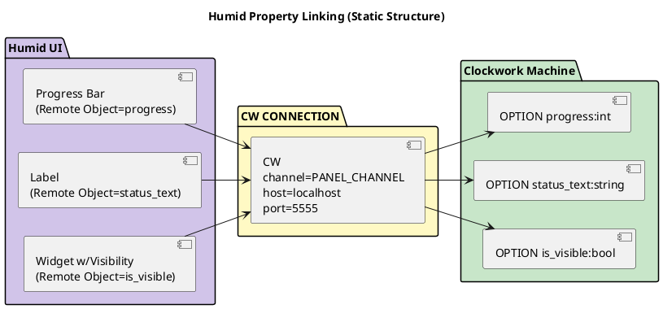
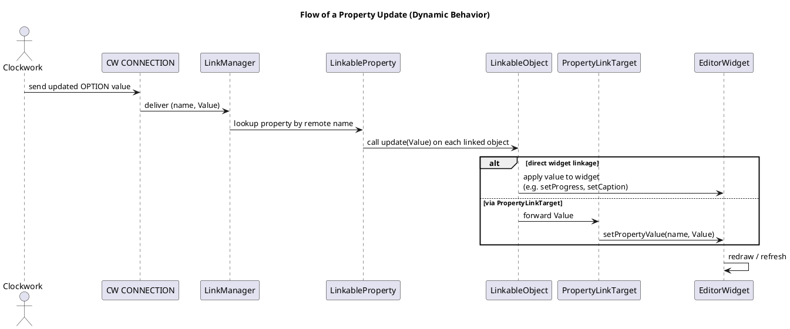

# Property Linking in Humid

Humid allows GUI widget properties to be **linked** to Clockwork machine properties (`OPTION`s).  
This document shows both the **structure** (which components connect) and the **runtime behavior** (how updates flow).

## Defining a Connection

To link Humid to a Clockwork machine, you must define a `CW CONNECTION` in your project settings file (`PROJECTSETTINGS.humid`):

```humid
PROJECTSETTINGS STRUCTURE(
    asset_path: "."
  ) {
  CW CONNECTION(
    channel: PANEL_CHANNEL,
    host: localhost,
    port: 5555
  );
}
ProjectSettings PROJECTSETTINGS(
    asset_path: "."
  );  
```

## Static Structure

The component diagram below shows how widgets in Humid are linked to Clockwork properties via a `CW CONNECTION`.



# Property Linking in Humid

Humid allows GUI widget properties to be **linked** to Clockwork machine properties (`OPTION`s).  
This document shows both the **structure** (which components connect) and the **runtime behavior** (how updates flow).

---

# Dynamic Behavior

The sequence diagram below shows the flow of a property
update at runtime, from Clockwork through Humid’s linking
mechanism to the widgets.



- Clockwork sends an updated property value.
- The connection passes it to the LinkManager.
- LinkManager delivers it to the correct LinkableProperty.
- Each linked LinkableObject updates either:
  - the widget directly, or
  - the widget property via a PropertyLinkTarget.
- Finally, the widget redraws to reflect the new value.

